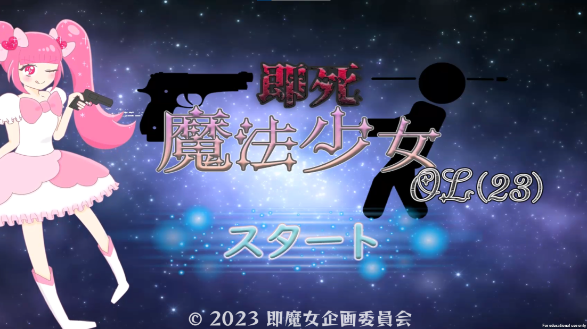

# Portfolio

- ゾッピ
- 連絡先 Email [aclzoppi.0715@gmail.com](mailto:aclzoppi.0715@gmail.com)
- 専門学校デジタルアーツ東京 ゲームプログラムコース 2025年卒業予定

## 資格

## スキル
- C#
  - 利用歴半年
- Unity
  - 利用歴半年
  - チーム作品の開発経験あり
- C/C++
  - 利用歴半年
  - コンソールで簡単なデータ処理プログラムを開発

## 取り組んでいるテーマ
1. オリジナルゲーム開発
2. 基本情報処理の内容を活用するゲーム制作事例の調査
3. 基本情報処理に関連する数学やアルゴリズムの仕組みを試せるアプリの開発

## 作品リスト

###即死魔法少女

- やくざの弾を避け、やくざを倒すシューティングゲーム。

- 開発環境:Unity2021.3.4f1  
- 開発期間:2023/9/8 ～ 2023/11/11

## 連絡先
- E-mail [aclzoppi.0715@gmail.com](mailto:aclzoppi.0715@gmail.cpm)